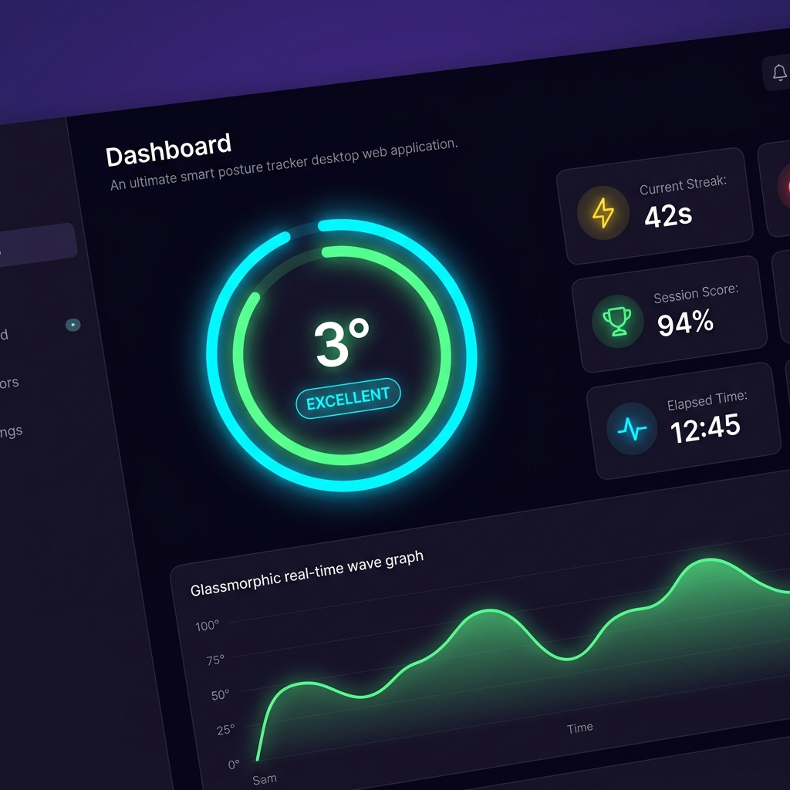
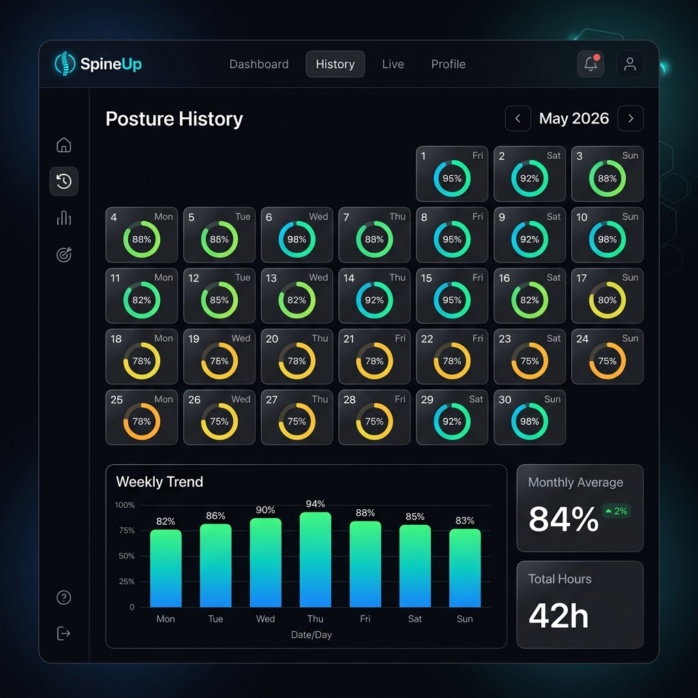
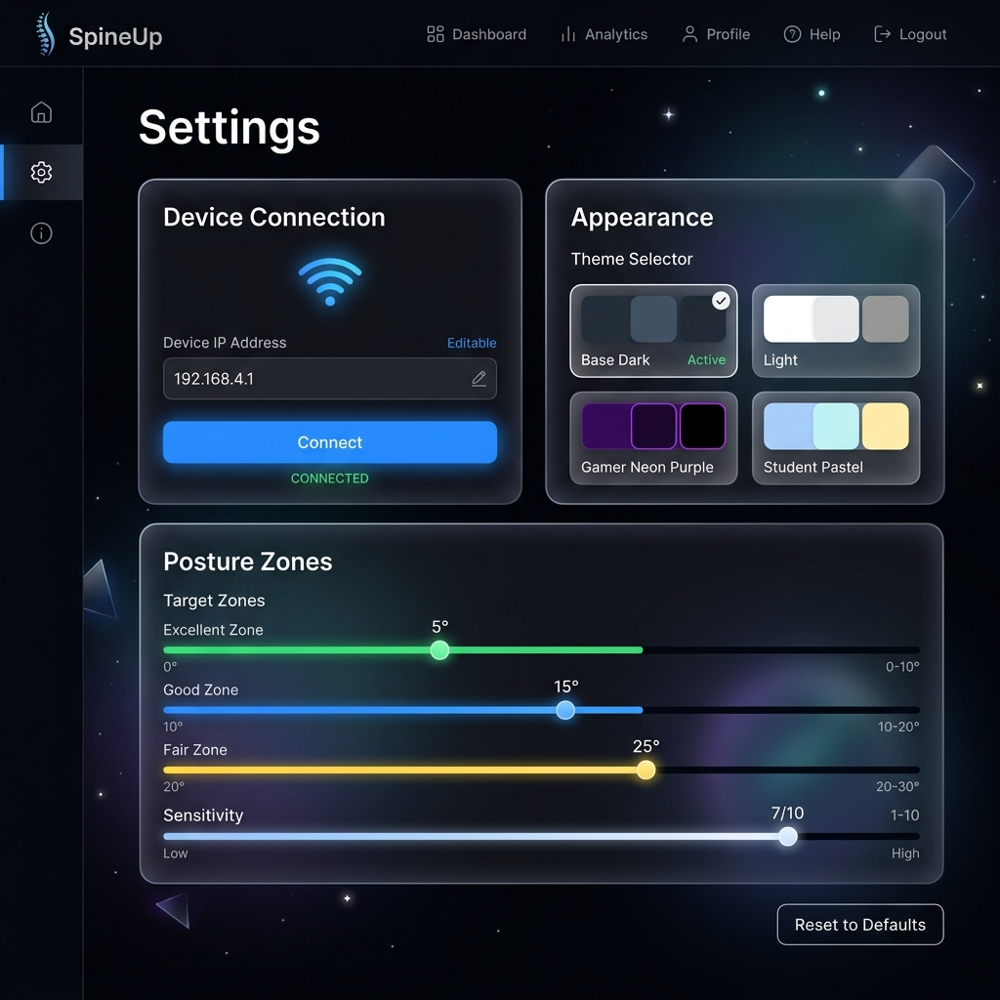
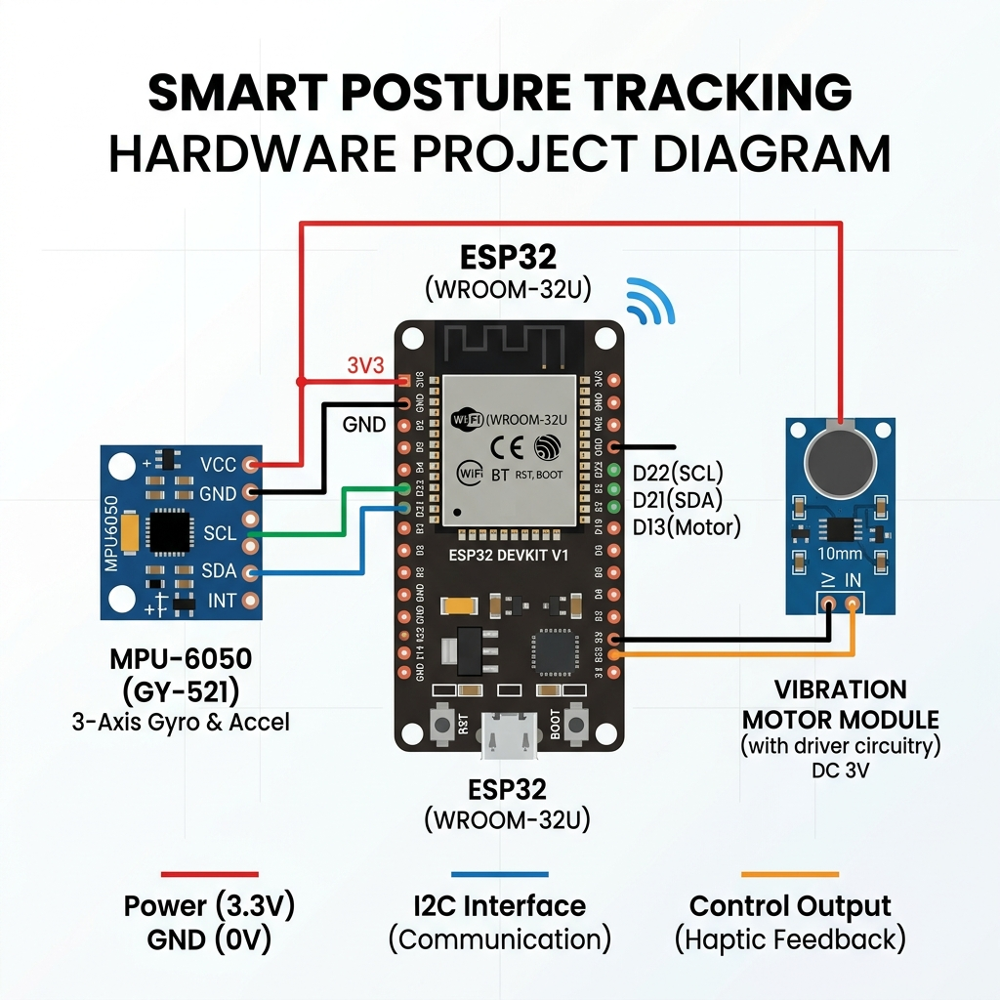

<](https://react.dev)
[](https://www.espressif.com/)
[](LICENSE)
[](https://tailwindcss.com/)
[](https://www.framer.com/motion/)

<br/>



<br/>

**SpineUp** is a full-stack IoT posture monitoring system that pairs an **ESP32 microcontroller** with an **MPU6050 accelerometer/gyroscope** to measure your spinal tilt angle in real time — then beams it over **WiFi** to a breathtaking **React dashboard** featuring Apple-inspired activity rings, live telemetry graphs, calendar history, multiple themes, and haptic motor feedback when you slouch.

<br/>

[✨ Features](#-features) · [📸 Screenshots](#-screenshots) · [🚀 Quick Start](#-quick-start) · [🔌 Hardware Setup](#-hardware-setup) · [⚙️ Configuration](#%EF%B8%8F-configuration) · [🏗️ Architecture](#%EF%B8%8F-architecture) · [📜 License](#-license)

</div>

---

## ✨ Features

<table>
<tr>
<td width="50%">

### 🎯 Real-Time Posture Monitoring
- **Apple Watch-style activity ring** — animated SVG ring fills dynamically based on your posture angle
- **Complementary filter fusion** — combines accelerometer + gyroscope data for drift-free, responsive angle tracking
- **Live area chart** — smooth, scrolling telemetry graph updated every 200ms
- **Instant status classification** — Excellent / Good / Fair / Poor with color-coded feedback

</td>
<td width="50%">

### 📊 Analytics & History
- **Session scoring** — cumulative posture score calculated from live data
- **Streak tracker** — counts consecutive seconds of good posture with milestone notifications
- **Calendar heatmap** — monthly view with conic-gradient score rings per day
- **Weekly trend chart** — bar visualization of your daily scores
- **Monthly statistics** — average score, total tracked hours, and trend deltas

</td>
</tr>
<tr>
<td>

### 🎨 Premium Design System
- **4 built-in themes** — Base (dark), Light, Gamer (neon), Student (pastel)
- **Glassmorphic panels** — frosted-glass card backgrounds with subtle borders
- **Smooth transitions** — Framer Motion page animations, hover effects, spring physics
- **Responsive layout** — desktop sidebar + mobile bottom navigation
- **Persistent preferences** — theme, IP address, and settings saved to localStorage

</td>
<td>

### 🔧 Hardware & Connectivity
- **ESP32 Access Point mode** — creates its own WiFi network, no router needed
- **RESTful `/angle` endpoint** — JSON API with CORS headers for cross-origin access
- **Vibration motor feedback** — haptic alert when tilt exceeds 40° threshold
- **Auto-calibration** — 500-sample startup calibration zeros out the sensor
- **Configurable sensitivity** — adjustable smoothing alpha and threshold zones from the UI

</td>
</tr>
</table>

---

## 📸 Screenshots

<div align="center">

### 🖥️ Dashboard — Live Tracking


> The main dashboard features an **Apple-style activity ring** with spring-animated fill, a live posture graph, streak counter, session score, and elapsed timer — all in a stunning dark glassmorphic layout.

---

### 📅 History — Calendar View



> Browse your posture history month by month. Each day shows a **conic-gradient progress ring** with hover tooltips. Weekly trends and monthly averages give you the full picture.

---

### ⚙️ Settings — Full Customization



> Configure your ESP32 IP address, choose from **4 gorgeous themes**, and fine-tune posture zone thresholds with interactive sliders. All preferences persist across sessions.

---

### 🔌 Hardware Diagram



> Simple 4-wire I2C connection between the ESP32 and MPU6050, plus a vibration motor on GPIO 23 for haptic slouch alerts.

</div>

---

## 🚀 Quick Start

### Prerequisites

| Tool | Version | Purpose |
|:-----|:--------|:--------|
| **Node.js** | 18+ | React development server |
| **npm** | 9+ | Package management |
| **Arduino IDE** | 2.x | ESP32 firmware upload |
| **ESP32 Board** | Any variant | Microcontroller |
| **MPU6050** | GY-521 module | 6-axis IMU sensor |

### 1️⃣ Clone the Repository

```bash
git clone https://github.com/maryam305/SELECED.git
cd SELECED
```

### 2️⃣ Install & Run the Web Dashboard

```bash
cd my-app
npm install
npm start
```

The app opens automatically at **[http://localhost:3000](http://localhost:3000)** 🎉

### 3️⃣ Flash the ESP32 Firmware

1. Open `PostureTracker/PostureTracker.ino` in the **Arduino IDE**
2. Install required libraries via Library Manager:
   - `Adafruit MPU6050`
   - `Adafruit Unified Sensor`
3. Select your board: **Tools → Board → ESP32 Dev Module**
4. Upload the sketch → The ESP32 creates a WiFi network called **`Posture_Alert_AP`**

### 4️⃣ Connect & Track

1. Connect your phone/laptop to the **`Posture_Alert_AP`** WiFi (password: `12345678`)
2. In the SpineUp web app, go to **Settings** → enter `192.168.4.1` → click **Connect**
3. Return to **Dashboard** → hit **Start Tracking** → sit up straight! 🧘

---

## 🔌 Hardware Setup

### Components Needed

| Component | Quantity | Purpose |
|:----------|:--------:|:--------|
| ESP32 Dev Board | 1 | Main controller + WiFi AP |
| MPU6050 (GY-521) | 1 | 6-axis accelerometer + gyroscope |
| Vibration Motor Module | 1 | Haptic slouch alert |
| Breadboard + Jumper Wires | — | Prototyping connections |
| USB Cable | 1 | Power + programming |

### Wiring Diagram

```
┌──────────────┐           ┌──────────────┐
│              │           │              │
│    ESP32     │    I2C    │   MPU6050    │
│              │           │   (GY-521)   │
│         3V3 ├───────────┤ VCC          │
│         GND ├───────────┤ GND          │
│     GPIO 21 ├───────────┤ SDA          │
│     GPIO 22 ├───────────┤ SCL          │
│              │           │              │
└──────┬───────┘           └──────────────┘
       │
       │ GPIO 23
       │
┌──────┴───────┐
│  Vibration   │
│    Motor     │
│   Module     │
└──────────────┘
```

### Pin Reference

| ESP32 Pin | Connects To | Wire Color (Suggested) |
|:---------:|:------------|:----------------------|
| `3V3` | MPU6050 VCC | 🔴 Red |
| `GND` | MPU6050 GND + Motor GND | ⚫ Black |
| `GPIO 21` | MPU6050 SDA | 🔵 Blue |
| `GPIO 22` | MPU6050 SCL | 🟢 Green |
| `GPIO 23` | Vibration Motor Signal | 🟠 Orange |

---

## ⚙️ Configuration

### Web App Settings (via UI)

| Setting | Default | Description |
|:--------|:-------:|:------------|
| Smoothing Alpha | `0.15` | EMA filter coefficient (0.01 = smooth, 0.5 = responsive) |
| Excellent Threshold | `5°` | Green zone — perfect posture |
| Good Threshold | `15°` | Blue zone — acceptable tilt |
| Fair Threshold | `25°` | Yellow zone — getting slouchy |
| Poll Interval | `200ms` | How often the app fetches angle data |
| Target Duration | `30 min` | Recommended session length |

### ESP32 Firmware Constants

| Constant | Default | Description |
|:---------|:-------:|:------------|
| `COMP_FILTER_COEFF` | `0.98` | Complementary filter ratio (gyro vs accel) |
| `MOTOR_PIN` | `23` | GPIO pin for vibration motor |
| Motor Threshold | `40°` | Tilt angle that triggers haptic feedback |
| Calibration Samples | `500` | Number of readings during startup calibration |

### Themes

| Theme | Description |
|:------|:------------|
| 🌑 **Base** | Deep space black with pink & blue neon accents |
| ☀️ **Light** | Clean Apple-style light mode with system grays |
| 🎮 **Gamer** | Electric purple/cyan neon with magenta highlights |
| 📚 **Student** | Calming dark slate with soft violet & blue pastels |

---

## 🏗️ Architecture

```
SpineUp System Architecture
═══════════════════════════

┌─────────────────────────────────────────────────────────┐
│                    React Web Dashboard                   │
│                                                         │
│  ┌──────────┐  ┌───────────┐  ┌──────────┐             │
│  │Dashboard │  │  History  │  │ Settings │   Framer     │
│  │  (Live)  │  │(Calendar) │  │ (Config) │   Motion +   │
│  └────┬─────┘  └───────────┘  └──────────┘   Recharts   │
│       │                                                  │
│       │  HTTP GET /angle (every 200ms)                   │
│       │  ← { "angle": 12.5 }                            │
└───────┼─────────────────────────────────────────────────┘
        │
   WiFi │  (ESP32 Access Point: Posture_Alert_AP)
        │
┌───────┴─────────────────────────────────────────────────┐
│                   ESP32 Firmware                         │
│                                                         │
│  ┌──────────┐  ┌──────────────┐  ┌────────────────┐    │
│  │WebServer │  │Complementary │  │  Calibration   │    │
│  │  (REST)  │←─│   Filter     │←─│   (500 samp)   │    │
│  └──────────┘  └──────┬───────┘  └────────────────┘    │
│                       │                                  │
│               ┌───────┴───────┐                         │
│               │   MPU6050     │    ┌─────────────┐      │
│               │  (I2C @0x68)  │    │  Vibration  │      │
│               │  Accel + Gyro │    │   Motor     │      │
│               └───────────────┘    │  (GPIO 23)  │      │
│                                    └─────────────┘      │
└─────────────────────────────────────────────────────────┘
```

### Tech Stack

| Layer | Technology | Role |
|:------|:-----------|:-----|
| **Frontend** | React 19, Framer Motion, Recharts, Lucide Icons | Interactive dashboard UI |
| **Styling** | TailwindCSS 3.4 + Inline theme system | Responsive, themeable design |
| **Transport** | HTTP REST (fetch API with AbortController) | Real-time data polling |
| **Firmware** | Arduino C++ (ESP32 WiFi + WebServer) | Sensor reading + API serving |
| **Sensor** | MPU6050 via Adafruit library (I2C) | 6-DOF inertial measurement |
| **Feedback** | Vibration motor on GPIO 23 | Physical slouch notification |

### Data Flow

```
MPU6050 → [I2C] → ESP32 → [Complementary Filter] → /angle JSON API
                                                          ↓
React Dashboard ← [HTTP GET every 200ms] ← WiFi AP ← ESP32
       ↓
  EMA Smoothing → Status Classification → Activity Ring + Graph + Stats
```

---

## 📂 Project Structure

```
SELECED/
├── 📁 PostureTracker/
│   └── PostureTracker.ino        # ESP32 firmware (MPU6050 + WiFi AP + REST API)
│
├── 📁 my-app/                    # React web dashboard
│   ├── 📁 public/
│   │   ├── index.html            # HTML entry point
│   │   └── favicon.ico           # App icon
│   ├── 📁 src/
│   │   ├── App.js                # Main application (986 lines — all components)
│   │   ├── App.css               # Legacy styles (overridden by Tailwind)
│   │   ├── index.js              # React DOM entry
│   │   └── index.css             # Tailwind directives + base styles
│   ├── tailwind.config.js        # Tailwind configuration
│   └── package.json              # Dependencies & scripts
│
├── 📁 screenshots/               # UI screenshots for documentation
│   ├── dashboard.png             # Dashboard view
│   ├── history.png               # History calendar view
│   ├── settings.png              # Settings panel view
│   └── hardware_diagram.png      # Wiring diagram
│
└── README.md                     # This file
```

---

## 🔑 Key Technical Details

### Complementary Filter (Sensor Fusion)

The firmware uses a **complementary filter** to combine accelerometer and gyroscope data, solving two fundamental problems:

| Problem | Accelerometer Only | Gyroscope Only | Complementary Filter ✅ |
|:--------|:-------------------|:---------------|:-----------------------|
| Noise | High-frequency jitter | Clean | Clean |
| Drift | No drift | Accumulates over time | No drift |
| Response | Slow / vibration-sensitive | Fast & smooth | Fast & smooth |

```c
// 98% gyro (fast, smooth) + 2% accelerometer (drift correction)
angle = 0.98 * (angle + gyro * dt) + 0.02 * accel_angle;
```

### EMA Smoothing (Web Dashboard)

The React app applies an **Exponential Moving Average** to the incoming angle values:

```javascript
smoothed = prev * (1 - alpha) + next * alpha;
// alpha = 0.15 by default (adjustable in Settings)
```

This eliminates WiFi-induced jitter while keeping the UI responsive.

### REST API Protocol

The ESP32 serves a single, ultrafast endpoint:

```
GET http://192.168.4.1/angle
→ Content-Type: application/json
→ Access-Control-Allow-Origin: *
→ { "angle": -3.72 }
```

---

## 🤝 Contributing

Contributions are welcome! Here's how you can help:

1. **Fork** the repository
2. **Create** a feature branch: `git checkout -b feature/amazing-feature`
3. **Commit** your changes: `git commit -m 'Add amazing feature'`
4. **Push** to the branch: `git push origin feature/amazing-feature`
5. **Open** a Pull Request

### Ideas for Improvement

- 📱 **Progressive Web App (PWA)** — offline support & installability
- 📈 **Cloud sync** — Firebase/Supabase for cross-device history
- 🔔 **Push notifications** — browser alerts for prolonged bad posture
- 🧪 **Unit tests** — Jest + React Testing Library coverage
- 📊 **CSV export** — download session data for research analysis
- 🎵 **Audio alerts** — configurable sound notifications

---

## 📜 License

This project is open source and available under the [MIT License](LICENSE).

---

<div align="center">

### Built with 💖 by [maryam305](https://github.com/maryam305)

_Sit up straight. Your spine will thank you._ 🧘

<br/>

⭐ **Star this repo** if SpineUp helped you build better posture habits!

</div>
]]>
